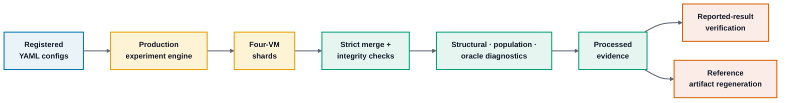

# Invariance Is Not Recovery

**Reproducible code, processed evidence, experiment configurations, and verification tools for finite-sample causal skeleton recovery under self-masking MNAR.**

<p align="center">
  <a href="#overview"><strong>Overview</strong></a> ·
  <a href="#quick-start"><strong>Quick start</strong></a> ·
  <a href="#experiment-program"><strong>Experiments</strong></a> ·
  <a href="#full-reproduction"><strong>Full reproduction</strong></a> ·
  <a href="#repository-structure"><strong>Repository map</strong></a> ·
  <a href="#documentation"><strong>Documentation</strong></a>
</p>

---

## Overview

This repository contains the complete public computational workflow used to study global and target-local causal skeleton recovery under self-masking Missing-Not-At-Random (MNAR) data. It includes the production experiment engine, fixed YAML configurations, processed evidence, scientific regression tests, reconstruction scripts, reference figures/tables, and formal source for selected mathematical components.

The repository is organized so that an independent researcher can either **verify the released evidence quickly** or **rerun the full distributed campaign from the registered configurations**.

### Start here

| Goal | Command / location |
| :--- | :--- |
| **Install the exact Python environment** | `python -m pip install -r requirements-lock.txt` |
| **Run the release verification suite** | `bash scripts/verify_release.sh` |
| **Exercise the global search branch** | `bash scripts/run_global_smoke.sh` |
| **Exercise the dedicated target-local branch** | `bash scripts/run_target_local_smoke.sh` |
| **Inspect the registered design** | [`docs/EXPERIMENT_DESIGN.md`](docs/EXPERIMENT_DESIGN.md) |
| **Inspect every output field** | [`docs/OUTPUT_SCHEMA.md`](docs/OUTPUT_SCHEMA.md) |
| **Trace reported results to code/evidence** | [`docs/RESULT_PROVENANCE_MAP.md`](docs/RESULT_PROVENANCE_MAP.md) |
| **Run the complete reproduction workflow** | [`docs/REPRODUCIBILITY_VALIDATION.md`](docs/REPRODUCIBILITY_VALIDATION.md) |

## Installation

Python **3.11+** is recommended.

```bash
python -m venv .venv
source .venv/bin/activate          # Windows: .venv\Scripts\activate
python -m pip install -r requirements-lock.txt
```

On Ubuntu, the setup can be performed automatically:

```bash
bash scripts/setup_ubuntu_vm.sh
```

The release also ships `requirements.txt` for a looser compatible environment; `requirements-lock.txt` is the reproducibility reference.

## Quick Start

Run the complete lightweight verification suite from the repository root:

```bash
bash scripts/verify_release.sh
```

This checks the scientific regression suite, reported-result reconstruction, reference-artifact regeneration, CLI surfaces, shell syntax, source hygiene, and both executable smoke paths.

To run only the two search branches:

```bash
bash scripts/run_global_smoke.sh
bash scripts/run_target_local_smoke.sh
```

Generated smoke outputs are written beneath `results/` and are excluded from version control.

## Experiment Program

All experiment blocks are defined by executable YAML files under [`configs/`](configs/). The YAML configurations and the production runner are the source of truth for the computational design.

| Block | Configuration | Registered cells |
| :--- | :--- | ---: |
| Primary scaling | [`configs/primary_scaling.yaml`](configs/primary_scaling.yaml) | 1,020 |
| Significance-threshold sensitivity | [`configs/significance_threshold_sensitivity.yaml`](configs/significance_threshold_sensitivity.yaml) | 360 |
| Retention sensitivity | [`configs/retention_sensitivity.yaml`](configs/retention_sensitivity.yaml) | 120 |
| Matched target-local/global | [`configs/matched_local_global.yaml`](configs/matched_local_global.yaml) | 240 |
| Precision extension (seeds 10–19) | [`configs/primary_scaling_precision_extension.yaml`](configs/primary_scaling_precision_extension.yaml) | 1,020 |
| **Complete registered program** |  | **2,760** |

The registered sample-size schedule is implemented once in `code/experiments/run_recovery_experiments.py` by `calibrated_sample_size(...)`. Human-readable details, including the exact integer schedule, are documented in [`docs/EXPERIMENT_DESIGN.md`](docs/EXPERIMENT_DESIGN.md).

## Reproduction Workflow



## Full Reproduction

The reference Python campaign used **four Ubuntu VMs**, each with:

| Resource | Per VM |
| :--- | ---: |
| vCPUs | **32** |
| RAM | **64 GB** |
| Local disk | **200 GB** |
| Python workers | **8** |

Run one primary shard on each VM:

```bash
# VM 0
N_JOBS=8 bash scripts/run_vm_shard.sh 0

# VM 1
N_JOBS=8 bash scripts/run_vm_shard.sh 1

# VM 2
N_JOBS=8 bash scripts/run_vm_shard.sh 2

# VM 3
N_JOBS=8 bash scripts/run_vm_shard.sh 3
```

Merge and analyze the primary, sensitivity, and matched-local blocks:

```bash
bash scripts/merge_and_analyze_campaign.sh
```

Run the non-overlapping precision-extension block with the same four-VM pattern:

```bash
N_JOBS=8 bash scripts/run_precision_extension_shard.sh 0
# repeat with shard indices 1, 2, and 3
bash scripts/merge_precision_extension.sh
```

After the registered computations finish, reconstruct the processed evidence and verify the released outputs:

```bash
N_JOBS=8 bash scripts/reconstruct_release_results.sh
```

For the exact execution contract, expected directory layout, merge rules, and reconstruction stages, see [`docs/REPRODUCIBILITY_VALIDATION.md`](docs/REPRODUCIBILITY_VALIDATION.md).

## Data and Outputs

The repository separates fixed released inputs from newly generated outputs:

| Path | Role |
| :--- | :--- |
| [`configs/`](configs/) | Fixed executable experiment configurations |
| [`evidence/`](evidence/) | Released processed evidence used by the verification layer |
| [`reference/`](reference/) | Reference figures, LaTeX tables, and native TikZ source |
| [`results/`](results/) | Outputs produced by new smoke/full executions |

`analysis/reconstruct_evidence.py` rebuilds the released evidence structure from completed raw experiment directories. `analysis/verify_evidence_reconstruction.py` compares a reconstructed evidence tree with the released reference using exact comparison for text/JSON fields and `1e-12` tolerance for numeric CSV fields.

## Repository Structure

| Path | Contents |
| :--- | :--- |
| [`code/`](code/) | Production runner, causal search, synthetic SEMs, self-masking mechanisms, diagnostics |
| [`configs/`](configs/) | Registered executable designs |
| [`analysis/`](analysis/) | Aggregation, paired contrasts, precision analysis, evidence reconstruction, validation, artifact generation |
| [`evidence/`](evidence/) | Released processed evidence |
| [`reference/`](reference/) | Reference computational artifacts |
| [`tests/`](tests/) | Scientific invariants and regression tests |
| [`scripts/`](scripts/) | Environment setup, distributed execution, merge, reconstruction, verification |
| [`docs/`](docs/) | Design, schema, provenance, and reproduction documentation |
| [`formal/`](formal/) | Lean 4 / Mathlib formal source for selected mathematical components |
| [`results/`](results/) | Generated execution outputs (not version-controlled) |

## Documentation

| Document | Purpose |
| :--- | :--- |
| [`docs/EXPERIMENT_DESIGN.md`](docs/EXPERIMENT_DESIGN.md) | Exact registered design and sample-size schedule |
| [`docs/OUTPUT_SCHEMA.md`](docs/OUTPUT_SCHEMA.md) | Result files, columns, and generated-output conventions |
| [`docs/RESULT_PROVENANCE_MAP.md`](docs/RESULT_PROVENANCE_MAP.md) | Reported result → configuration → code → evidence trace |
| [`docs/NUMERICAL_VALIDATION.md`](docs/NUMERICAL_VALIDATION.md) | Released numerical validation record |
| [`docs/REPRODUCIBILITY_VALIDATION.md`](docs/REPRODUCIBILITY_VALIDATION.md) | Release gate and full-campaign reproduction protocol |
| [`formal/README.md`](formal/README.md) | Formal project layout and build instructions |

## Formal Source

Selected mathematical components are formalized in Lean 4 / Mathlib under [`formal/`](formal/). When Lean/Lake is installed:

```bash
bash formal/build_all.sh
```

The formal source is supplementary to the computational workflow and can be built independently.

## License

Released under the [MIT License](LICENSE).
